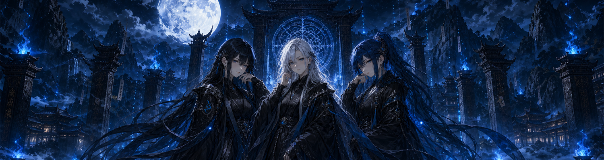
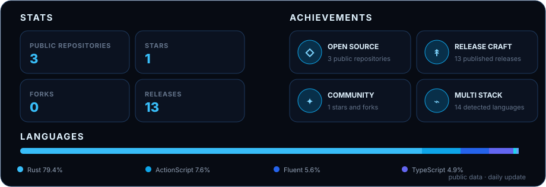

  

  <h1>DIVINELABS</h1>
    

  
  
  

 

  <h3>DISCIPLINES</h3>

<table align="center">
  <tr>
    <td align="center" width="110"> <b>Kotlin</b></td>
    <td align="center" width="110"> <b>Java</b></td>
    <td align="center" width="110"><picture><source media="(prefers-color-scheme: dark)" srcset="assets/stack/rust-white.svg" /></picture> <b>Rust</b></td>
    <td align="center" width="110"> <b>Gradle</b></td>
    <td align="center" width="110"> <b>Actions</b></td>
    <td align="center" width="110"> <b>PowerShell</b></td>
  </tr>
</table>

  <h3>STATS & ACHIEVEMENTS</h3>
  

 

  <h3>PORTFOLIO</h3>

<!-- PORTFOLIO:START -->
<!-- Selected project cards will be placed here. -->
<!-- PORTFOLIO:END -->
